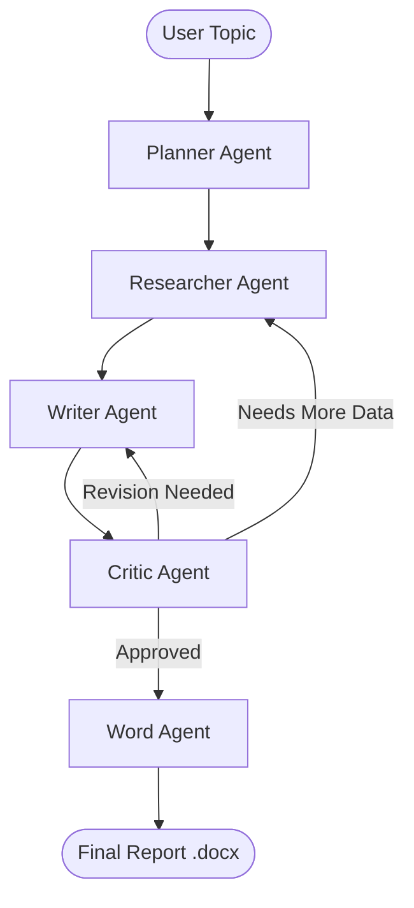

<div align="center">
  
  
  
  
</div>

<h1 align="center">🌌 Multi-Agent Research System (MARS)</h1>

<p align="center">
  <b>A state-of-the-art agentic pipeline that orchestrates specialized AI agents to generate deep-dive research reports.</b>
</p>

<p align="center">
  <a href="#-architecture">Architecture</a> •
  <a href="#-features">Features</a> •
  <a href="#-quick-start">Quick Start</a> •
  <a href="#-frontend">Frontend</a> •
  <a href="#-api-reference">API</a>
</p>
[Watch Demo](https://raw.githubusercontent.com/peakscripter/Multi-Agent-Research-System/main/assets/demo mars.mp4)

---

## 🏗 Architecture

MARS uses a sophisticated **LangGraph** workflow to coordinate agents through iterative research, writing, and critique cycles.



| Agent | Capability |
|-------|------------|
| 🗂 **Planner** | Structures the research trajectory and key sections. |
| 🔍 **Researcher** | Scours ArXiv, GitHub, and Semantic Scholar for real data. |
| ✍️ **Writer** | Synthesizes information into a cohesive, academic-grade report. |
| 🧐 **Critic** | Enforces quality, accuracy, and depth through feedback loops. |
| 📝 **Word** | Produces production-ready `.docx` files with proper formatting. |

---

## ✨ Features

- **Agentic Orchestration** — Built on LangGraph for robust, stateful agent coordination.
- **Deep Research** — Integrated with multiple data sources for factual grounding.
- **Voice-Enabled** — Supports audio input via Sarvam AI STT for hands-free research.
- **Dual Frontends** — Choose between a lightweight standalone UI or a professional React dashboard.
- **Vector Memory** — Uses Qdrant to store and retrieve past research findings (RAG).
- **Pro Formatting** — Automatically generates polished Word documents for immediate use.

---

## ⚡ Quick Start

### 1. Prerequisites
- Python 3.10+
- [Groq API Key](https://console.groq.com/)
- (Optional) [Sarvam AI Key](https://dashboard.sarvam.ai/) for voice features.

### 2. Installation
```bash
# Clone the repository
git clone https://github.com/PeakScripter/Multi-Agent-Research-System.git
cd Multi-Agent-Research-System

# Install dependencies
pip install -r requirements.txt
```

### 3. Configuration
Copy the example environment file and fill in your keys:
```bash
cp .env.example .env
```
*Make sure to set `GROQ_API_KEY` in the `.env` file.*

### 4. Run CLI
```bash
python main.py "Impact of Quantum Computing on Cryptography" --docx
```

---

## 🌐 Web Interface

MARS provides two ways to interact with the system via a browser:

### Option A: Professional React App (Recommended)
A modern, feature-rich dashboard built with React, Vite, and Tailwind CSS.
```bash
cd frontend
npm install
npm run dev
```

### Option B: Standalone UI
A lightweight, single-file frontend for quick access.
1. Start the backend: `python app.py`
2. Open `index_1.html` directly in your browser.

---

## 🚀 API Reference

Start the server using Uvicorn:
```bash
python -m uvicorn app:app --host 0.0.0.0 --port 8000
```

| Endpoint | Method | Description |
|----------|--------|-------------|
| `/research` | POST | Trigger the full multi-agent research pipeline. |
| `/chat` | POST | Chat with the agentic research assistant. |
| `/voice` | POST | Upload audio for automated transcription and research. |
| `/documents`| GET | List all generated research reports. |
| `/status` | GET | Check Groq model health and availability. |

---

## 📁 Project Structure

- `agents/` — Logic for Planner, Researcher, Writer, Critic, and Word agents.
- `rag/` — Vector database integration (Qdrant).
- `voice/` — Speech-to-text and Text-to-speech modules.
- `outputs/` — Stores generated reports, logs, and metadata.
- `app.py` — FastAPI server implementation.
- `workflow.py` — LangGraph state machine definition.

---

## 📄 License

This project is licensed under the MIT License. See [LICENSE](LICENSE) for details.

---

<p align="center">Built with ❤️ by the PeakScripter Team</p>
